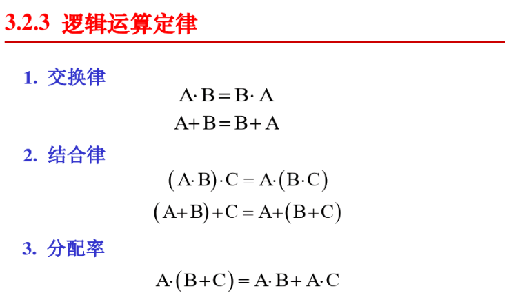
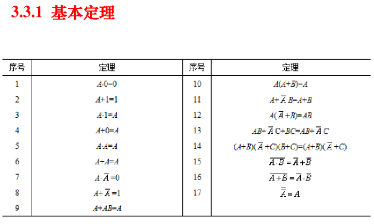

# <center>计算机系统要素-练习</center>

----------

### 官方网站  
[https://www.nand2tetris.org/](https://www.nand2tetris.org/)  
### 使用说明  
运行工具前安装最新的java运行环境，我遇到了在较低版本有乱码情况。  
做到第五章时才发现vscode有Nand2Tetris的扩展插件，装上之后有语法高亮、变量提示和代码片段生成，可以避免出现拼写错误的问题，建议装上。

### 第一章  
需要逻辑代数基本知识，并结合书中布尔代数一节的规范表示法来推导：  
例如：  
  
因此它的代码是：  
``` hdl  
CHIP DMux {
    IN in, sel;
    OUT a, b;

    PARTS:
    // Put your code here:
    Not(in=sel,out=nsel);
    And(a=in,b=nsel,out=a);
    And(a=in,b=sel,out=b);
}
```  

注意在硬件模拟器中数据是小端模式，也是就是低位在管脚的低位，另外低位在右边。  

  
  

### 第二章  
最重要是注意附录A对HDL语法的说明，A.5.2和A.5.3。其中说明的输入管脚也可以是常量true或false,并且可以x[i..j]=true的方式批量对多位赋值。  
ALU的逻辑实现比想像中简单，因为书里给出的ALU已经是精心设计过的，每一种输入信号的组合和对应的功能都已经列清楚了。  
有两个心得：  
1、逻辑门不存在高层逻辑中if那种跳过分支的效果，需要同时计算if的所有分支，然后用Mux选择其中一个输出。  
2、判断一个16位数是否为0和是否是负数，我是采用了对其加另一个适当的数，然后用其进位来做选择。因此我还修改了Add16.hdl的输出定义，增加了carry输出。不知道是否有更好的办法。(看到网上资料采用的Or16Way，不过第一章并未实现这个芯片)  

### 第三章  
在网上资料看到了一个被调用芯片的输出管脚可以同时连接内部管脚和输出管脚，这是我没想到的。  
例如`DFF(in=in,out=loop,out=out);`，DFF的out同时连到了一个内部管脚loop和输出管脚out。如果直接用输出管脚去连接到其它调用芯片的输入管脚是会报错的。前面的章节因为我不知道这个，还绕了些弯去解决。  
RAM8思路：用DMux8Way把load信号分解成8路信号，用来控制8个Register读写，然后用Mux8Way16选择Register的8路输出其中一路。  
RAM16思路：address是6位，高3位用在RAM16本身，用于分解load信号到8路，控制8个RAM8读写；低3位传入RAM8用于RAM8的内部选择逻辑。   
PC芯片确实有点复杂，思路是：Register在`reset\load\inc`时，都是需要读入数据的，并且我们应结合控制位为它构造合适的数据。`reset`优先级最高，其次是`!reset&load`，再次是`!reset&!load&inc`，最低是`!reset&!load&!inc` 
（网上的PC芯片实现很简单，感觉我这个是按逻辑流程硬怼，这样的电路肯定性能上是不行的。我看网上的实现较多的使用了反馈回路之类的东西，后面我再做优化吧。。） 

### 第四章  
这一章对程序员比较友好，只用考虑语法，不用考虑的电路和电压。  
汇编实现乘法比较简单，只需注意一点：`@val`语法，如果`val`是一个用户变量的话，它实际是一个从16开始的数。含义是`RAM`中一个可寻址单元的地址（按声明顺序递增，另外0~15的是虚拟寄存器）。`@val`是把`val`所代表的数写入`A`寄存器，用`A`去访问的话是数值本身，用`M`去访问的话，是`RAM[val]`的值。 
屏幕控制程序:A指令LSB是0，只有15个有效位因此不能通过存储颜色值，并赋值给内存单元的方式。可以用C指令M=-1，-1的补码正好是0xffff  

### 第五章  
感觉需要综合前几章的芯片，因此在开做之前先做个分析。  
#### 练习前的分析  
##### CPU芯片  
指令内存和数据内存地址空间共`2^16`位，因此各自可用为`2^15`，即地址是15位

CPU的输入是：指令内存、数据内存各一个字（16位），复位标识1位。
CPU的输出是：输出字（16位），数据内存地址（15位），写入标识1位，指令内存地址（15位,也即PC）

对于CPU中的关键：ALU而言  
ALU的输入是：D寄存器，A寄存器或RAM[A]，以及ALU的一堆控制位（应该从指令中分离出来）
ALU的输出是：字（16位），zr，ng（后两者应该是用于C指令的跳转判断）

PC的输入：自增标识1位，输入地址(15位)，写入标识1位，复位标识1位
PC的输出：输出地址（15位）  

CPU完成感言：这一章我拖了很久，其实完成后并没有看到的那么复杂，大胆动手写下代码吧！  


### 第六章  
需注意hack机器码文件的格式是一条指令一行，并且每行是包含0、1的文本串，而不是二进制0、1。  
符号表的构建：符号表内置内建符号，伪指令中的符号在第一遍解析汇编文件时收集，A指令中的变量在第二遍解析汇编时加入。  


### 第七章  
>VM的实现可以通过多种途径：通过软件翻译器，通过特殊用途的硬件，或者通过把VM程序翻译成目标平台的机器语言。  

本书要实现的VM方案是把VM程序翻译成目标平台的机器语言。  
  
关于vm语言中的if如何实现：汇编语言中jump有各种判断，因此通过jump到不同的符号，就可以实现把True或False写到D寄存器中。  

上一章和本章我采用python来实现，本章可以复用上一章的很多代码。  
个人感觉加入了vm中间层之后指令的效率会低一些，因为数据都会通过栈来中转，读写指令会多一些。  

pop segment index指令的翻译，当segment是基地址加偏移类型时，稍微没那么直接，因为弹栈和计算写入地址会互相覆盖A、D寄存器，因此无法直接衔接。于是我把写入地址计算出来后，先放到通用寄存器R13中，然后弹栈到D寄存器，之后就不需要再占用D寄存器去算地址了。  

### 第八章  
把上一章的实现复制过来做扩展就好。  
关于Sys.init的表述可能会让人有点误解，实际上在VmTranslator里只需要实现call Sys.init就可以了，Sys.init函数的生成是由高级语言编译到vm时产生的。  
因为安排为分阶段实现，因此本章项目的ProgramFlow部分和FunctionCalls的SimpleFunction不用考虑调用Sys.init，由测试脚本完成vm初始化。  